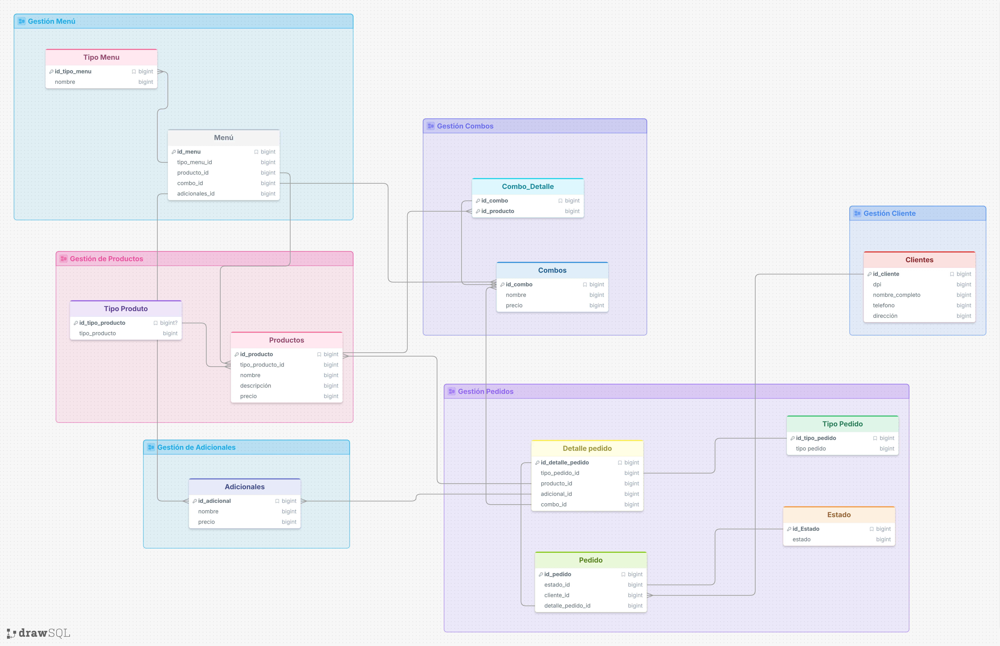

# Base de Datos Campus Pizz

Base de datos que ayuda a la pizzería "Campus Pizza" a tener una mejor estructura un mejor flujo de sus datos.

## Diagrama inicial de la base de datos

El diagrama indica el grupo en que pertenece cada tabla, para tener un mejor fluidez al momento de hacer la base de datos en fisico (scripts);

## Archivos agregados

1. DDL.sql: Donde se encuentra los scripts de creación
2. DML.sql: Donde se encuentran los datos insertados